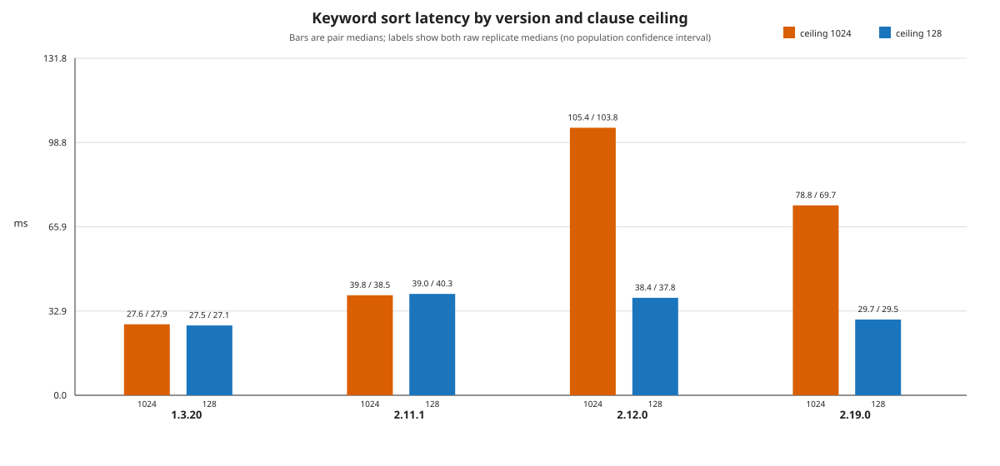
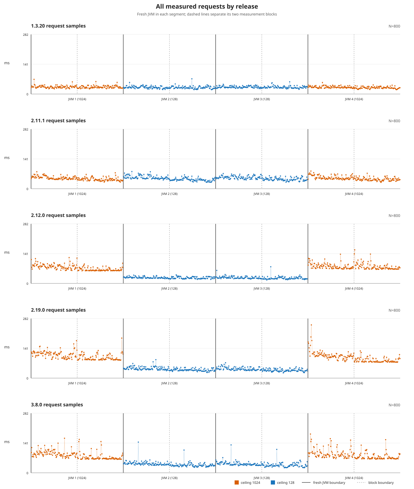

# OpenSearch keyword-sort latency regression

**Lowering the Boolean clause limit made keyword-sorted searches about 2–3× faster on three tested OpenSearch releases.**

On this reproduction workload, changing `indices.query.bool.max_clause_count` from its default of 1024 to 128 reduced latency on OpenSearch 2.12.0, 2.19.0, and 3.8.0. The same change had little effect on 1.3.20 and 2.11.1.

The query contains only one term filter. The setting matters because Lucene also uses it inside its keyword-sort implementation.

## Results



Each setting was tested twice, starting a new OpenSearch container each time. Labels show both results. See the [original five-version Actions run](https://github.com/camerondurham/bug-repro-opensearch-keyword-sort/actions/runs/36336273811) and [saved results](results/summary.md).

Compare settings within each release, not absolute timings between releases. Hosted machines and bundled software differ.

Three local repetitions also showed the setting effect. See the [original local investigation](https://github.com/camerondurham/bug-repro-opensearch-keyword-sort/blob/084a4b3171e2abd71edb86e68b0275f5b2d87752/comparisons/local-vs-actions-20260927/FINDINGS.md) for those measurements.

<details>
<summary>All measured requests</summary>



</details>

## Reproduce the issue

### Run the standalone reproducer

[`minimal_repro.py`](minimal_repro.py) is a standard-library script for a compact upstream reproduction. Its defaults run four versions, start two new containers per version, and use an 8g heap:

```bash
python3 minimal_repro.py
```

The script docstring lists its Docker and Python prerequisites and the optional `--versions`, `--docs`, `--shards`, `--heap`, and `--reverse` options. The default 8g heap needs extra Docker headroom. The script defaults differ from the published five-version matrix and fixture, so this command is not identical to the published protocol. It removes the containers and networks it creates, and reports cleanup failures rather than treating them as clean.

### Run one release with the published protocol

Use a disposable Linux x86-64 host with Docker and Python 3.10 or newer. Allow at least 7 GiB RAM and about 15 GiB free disk. Set `vm.max_map_count >= 262144` and avoid competing workloads.

```bash
python3 repro.py --version 3.8.0 --output artifacts/3.8.0
```

Use a new output directory for each run. The command prints paired client and server ratios and retains `result.json`. A single-release run reports `NOT_ASSESSED`, which is not a failure. The default report assesses `REPRODUCED` only for a complete five-version matrix.

Changing the limit can reject larger Boolean or expanded queries. This is a diagnostic experiment, not a general production recommendation.

### Compare this machine with GitHub

Run three complete matrices and save a comparison ready to commit:

```bash
python3 run_comparison.py --output comparisons/my-machine
```

Use `--replace` to rerun an existing machine directory. See the [comparison guide](comparisons/README.md) for prerequisites, replacement behavior, and contributing results.

### View saved results without Docker

The reporter uses Python's standard library and accepts `results/raw/`, an Actions artifact tree, one JSON file, or a retained result directory:

```bash
python3 report.py --input results/raw --output local-report
```

Open `local-report/report.html`. To render one retained release, use:

```bash
python3 report.py --input artifacts/3.8.0 --version 3.8.0 --output local-report
```

The reporter uses the sample counts, heap, and fixture parameters recorded by the runner. It writes reports to `--output`, replacing existing report files there. See [Supporting evidence and offline checks](#supporting-evidence-and-offline-checks) for in-place regeneration and the historical archive option.

## Why the setting affects sorting

Lucene's keyword-sort comparator builds a postings-based competitive iterator. Its gate is `Math.min(MAX_TERMS, IndexSearcher.getMaxClauseCount())` in [`PostingsBasedCompetitiveState`](https://github.com/apache/lucene/blob/releases/lucene/10.5.0/lucene/core/src/java/org/apache/lucene/search/comparators/TermOrdValComparator.java#L522), with the constant at [line 524](https://github.com/apache/lucene/blob/releases/lucene/10.5.0/lucene/core/src/java/org/apache/lucene/search/comparators/TermOrdValComparator.java#L524) and the gate at [line 581](https://github.com/apache/lucene/blob/releases/lucene/10.5.0/lucene/core/src/java/org/apache/lucene/search/comparators/TermOrdValComparator.java#L581). [Lucene #11903](https://github.com/apache/lucene/pull/11903) and [commit `f1d763a`](https://github.com/apache/lucene/commit/f1d763a75014c8a7ab9654b3038b50f64faba348) increased `MAX_TERMS` from 128 to 1024 in Lucene 9.9, bundled by OpenSearch 2.12.0.

Lowering the ceiling limits when this postings optimization can be used for the workload. It does not mean every request always switches paths. Enumerating extra postings can cost more than it saves, so the lower ceiling can improve this reduced search.

Lucene 10.5.0, bundled by OpenSearch 3.8.0, still has the same gate. Indexed-keyword sorting uses the postings path, while the newer doc-values [`SkipperBasedCompetitiveState`](https://github.com/apache/lucene/blob/releases/lucene/10.5.0/lucene/core/src/java/org/apache/lucene/search/comparators/TermOrdValComparator.java#L648) has adaptive disabling at [line 694](https://github.com/apache/lucene/blob/releases/lucene/10.5.0/lucene/core/src/java/org/apache/lucene/search/comparators/TermOrdValComparator.java#L694). This experiment changes a shared setting on stock binaries. It is not an isolated revert of one commit.

## Testing methodology

### Workload

The fixture contains 198,000 deterministic documents inserted in permuted order. It uses 18 primary shards with no replicas, explicit refreshes targeting approximately two segments per shard, and no force merge or writes during timing. Segment inventories are checked. The first sort key is a unique primary keyword and the second is a long.

```json
{
  "size": 250,
  "version": true,
  "query": {"bool": {"filter": [{"term": {"tenant_id": "tenant-a"}}]}},
  "sort": [{"item_key": "asc"}, {"market_id": "asc"}],
  "_source": {"excludes": ["source_records.*"]}
}
```

The first 250 results are repeated with no pagination, routing, `search_after`, or PIT. `track_total_hits` is omitted, so each release uses its default.

### Versions and observed effect

| OpenSearch | Bundled Lucene | Observed effect of lowering the limit |
|---|---|---|
| 1.3.20 | 8.10.1 | Little change |
| 2.11.1 | 9.7.0 | Little change |
| 2.12.0 | 9.9.2 | Faster, published pairs 2.77–3.17× |
| 2.19.0 | 9.12.1 | Faster, published pairs 2.34–2.52× |
| 3.8.0 | 10.5.0 | Faster, published pairs 2.05–2.06× |

### Comparison and metrics

Each release uses four separately started containers in order 1024 → 128 → 128 → 1024. Each container has two blocks of 100 validated warmups followed by 100 measured requests. That is 800 measured requests per release, 4,000 across five releases, and 20 containers in total. The setting is applied at startup because older releases reject dynamic updates.

The run uses pinned stock linux/amd64 images with the same resolved image for a release. Docker is limited to 2 CPUs and 5 GiB. Java uses a 2 GiB heap and 2 active processors. Bundled JDK identities are retained.

For each block, the reporter calculates a median. It calculates a container result as the median of that container's two block medians. Chart bars are the median of the two container results for each setting, and labels show both container results. Both opposite-order default/lowered ratios are reported. Client time includes HTTP and JSON decoding but excludes oracle checking. Server `took` is the integer-millisecond duration returned by OpenSearch and excludes client and network time. A zero denominator is reported as `n/a`.

### Checks and offline evidence

During the live run, every warmup and measured response must match an independently computed result: 250 hits with the expected IDs, sort values, versions, and source fields in the expected order. Timeouts and failed or skipped shards invalidate the run. Startup settings are read back. Document and deletion counts, merge counters, and segment identities must remain fixed across measurement blocks. Per-shard segment document and deletion inventories must also match across rebuilt containers within a release. Engine and image identities, host locking, deadlines, loopback-only access, and exact-ID owner-labeled cleanup are checked.

The offline reporter recomputes timing summaries and ratios from the saved samples. It checks recorded sample counts, labels, version metadata, validation and cleanup status, and matching result hashes and parameters. It cannot independently repeat live response validation because response bodies and settings readbacks are not retained. Missing or invalid evidence fails reporting.

### Verdict

`REPRODUCED` requires both pairs for 2.12.0 and 2.19.0 to be at least 1.25×, and both pairs for 1.3.20 and 2.11.1 to fall within 0.80–1.25×. This is a descriptive rule, not a significance test. 3.8.0 must have valid data but its speedup is not required for the historical verdict. A single-version report is `NOT_ASSESSED`.

## Limitations and repeatability

This is a read-only reduced first-page workload. It does not cover production writes, cleanup, or full result traversal. Two comparisons per version in the published run do not support a broad statistical claim.

The [original local investigation](https://github.com/camerondurham/bug-repro-opensearch-keyword-sort/blob/084a4b3171e2abd71edb86e68b0275f5b2d87752/comparisons/local-vs-actions-20260927/FINDINGS.md) ran three matrices on one Ryzen 7 7800X3D under WSL2. Its 2.19.0 speedups ranged from 2.844–6.475×, including a container whose client block medians fell from 67.684 to 21.189 ms. Those records retain the outlier but cannot identify its cause. The warmups do not prove steady-state timing, and one host does not establish variation across the GitHub fleet.

For new machine-specific runs, use the [local comparison guide](comparisons/README.md). Do not pool machines: each output compares its three local repeats with the unchanged Actions reference.

## Supporting evidence and offline checks

The manual [GitHub Actions workflow](https://github.com/camerondurham/bug-repro-opensearch-keyword-sort/actions/workflows/reproduce.yml) offers the default `parallel` five-job mode. Its opt-in `repeated` mode runs three fresh hosted VMs, each with a full five-version matrix in varied order and a 70-minute matrix-job cap. Repeated mode has been checked offline but has not been run live on GitHub. Its implementation is in the [workflow](.github/workflows/reproduce.yml).

There are no schedules, push-triggered benchmarks, or automatic retries. Missing or invalid evidence fails reporting. A green evidence check is distinct from the `REPRODUCED` verdict. Artifacts are retained for 30 days and committed history remains available.

Run the existing offline checks with no Docker or network:

```bash
python3 -m unittest -v
python3 report.py --self-test
```

Regenerate the full report from the same raw source and run without changing raw inputs:

```bash
python3 report.py --input results/raw --output results
```

The reporter preserves raw inputs byte-for-byte. Do not splice a new release into an existing matrix. For the archived four-version dataset, use `--historical-matrix` and the [historical results](https://github.com/camerondurham/bug-repro-opensearch-keyword-sort/tree/38f9db311c3262ea2c532bda02ef5eacaf34b575/results). For new local comparisons, use the [comparison guide](comparisons/README.md), including its offline re-render command.

## Provenance

OpenSearch 3.8.0 is identified by the [official release](https://github.com/opensearch-project/OpenSearch/releases/tag/3.8.0), release commit [`e5a3c569`](https://github.com/opensearch-project/OpenSearch/tree/e5a3c5691be87af6c12dbe3e158c59c04ee72973), its [Lucene dependency](https://github.com/opensearch-project/OpenSearch/blob/e5a3c5691be87af6c12dbe3e158c59c04ee72973/gradle/libs.versions.toml#L3), and the [clause-ceiling setting](https://github.com/opensearch-project/OpenSearch/blob/e5a3c5691be87af6c12dbe3e158c59c04ee72973/server/src/main/java/org/opensearch/search/SearchService.java#L398). Its official linux/amd64 image manifest is pinned as `sha256:68a688de28fb9bb66601552650b91a52a9fd5e7eac5481dd2b225ecb66fd09b0`. Sibling release digests are also pinned in `repro.py`.

Useful source references are the [Lucene 9.12.1 comparator](https://github.com/apache/lucene/blob/releases/lucene/9.12.1/lucene/core/src/java/org/apache/lucene/search/comparators/TermOrdValComparator.java#L547), [OpenSearch 2.19 setting](https://github.com/opensearch-project/OpenSearch/blob/2.19.0/server/src/main/java/org/opensearch/search/SearchService.java#L321), and [forwarding to Lucene](https://github.com/opensearch-project/OpenSearch/blob/2.19.0/server/src/main/java/org/opensearch/search/SearchService.java#L469). The standalone script is published unchanged with SHA-256 `228674cab284f2cb6cd695a4ff9f39d7bbaddc70da1d81341734c274a7c36037`.

This reproduction came from an earlier private investigation workspace. The original investigation concerned upgrade-related latency. This repository isolates its read-only sorted-search finding and contains no production data, credentials, or patched binaries. The GitHub Actions setup follows the pinned-release pattern of the [routing reproduction](https://github.com/camerondurham/bug-repro-opensearch-routing).

## License

Apache License 2.0, see [LICENSE](LICENSE).
