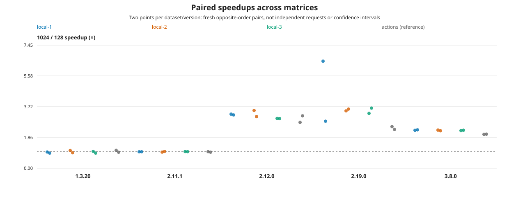
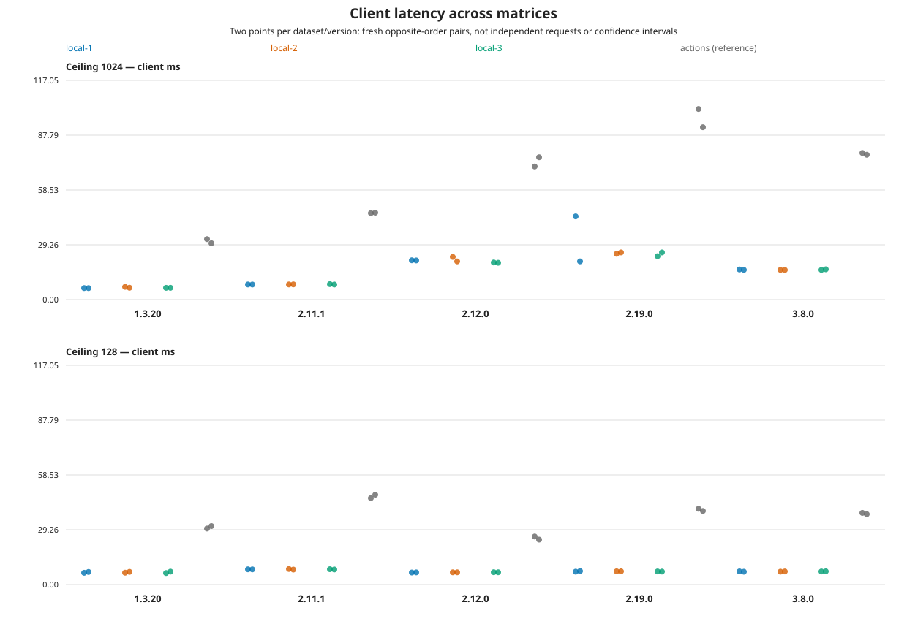

# Local repeatability versus GitHub Actions

**The setting effect reproduces locally, but repeated runs reveal variability that a single matrix can hide.** Keep the fast GitHub mode as the default; use the new optional repeated mode for reliability claims.

Three complete local matrices, 15 successful version invocations, 60 fresh JVMs and **12,000 measured requests** completed in **28 minutes 4 seconds**. All three met the predeclared historical-boundary rule; every runner recorded valid responses/layouts and clean cleanup. [Independent retained-evidence verification](verification.json), [execution receipt](execution.log), and the [frozen experiment](experiment.json).

## Paired setting effects

Ranges include **all six local pairs**, including the outlier. GitHub ranges contain the two pairs from [run 36336273811](https://github.com/camerondurham/bug-repro-opensearch-keyword-sort/actions/runs/36336273811).

| Version | Local paired speedups | GitHub paired speedups | Interpretation |
|---|---:|---:|---|
| 1.3.20 | 0.912–1.073× | 0.965–1.080× | Negative control stays near 1× |
| 2.11.1 | 0.972–1.015× | 0.968–1.000× | Negative control stays near 1× |
| 2.12.0 | 3.001–3.493× | 2.772–3.167× | Strong effect in both environments; some magnitude variation |
| 2.19.0 | **2.844–6.475×** | 2.343–2.516× | Effect consistent in direction; magnitude unstable locally |
| 3.8.0 | **2.267–2.320×** | 2.047–2.059× | Highly repeatable locally; not numerically identical across environments |



For 3.8.0 the local ratio range is **2.3% of the median**, and the two settings' across-round latency ranges are each about **1.1–1.2%**. For 2.19.0 the ratio range is **103.1% of the median** and the default-setting round-median range is **33.2%**; its 128-setting round medians vary only **1.3%**.

The predeclared descriptive ratio-spread threshold also flags 1.3.20 (16.8%) and 2.12.0 (15.5%). Those flags do not overturn the control/affected classifications or invalidate their records. See the [complete client/server table and spread calculations](summary.md).

## Absolute timing is host-dependent

| Version | Local 1024 round-median range (ms) | Local 128 round-median range (ms) | GitHub 1024 / 128 medians (ms) |
|---|---:|---:|---:|
| 1.3.20 | 6.134–6.560 | 6.496–6.551 | 31.197 / 30.554 |
| 2.11.1 | 8.055–8.148 | 8.113–8.152 | 46.297 / 47.051 |
| 2.12.0 | 19.743–21.596 | 6.456–6.567 | 73.552 / 24.821 |
| 2.19.0 | 24.175–32.424 | 6.956–7.048 | 96.907 / 39.873 |
| 3.8.0 | 15.841–16.022 | 6.927–7.007 | 77.826 / 37.918 |



Local execution used one AMD Ryzen 7 7800X3D machine under WSL2, one boot, with sequential versions and varied order across matrices. GitHub used a separate hosted VM per version. Image IDs, bundled JDKs within each version, query, fixture, sample counts and resource caps match; hosts, kernels and clients differ. **This is not a host-population variance estimate or proof that CPU hardware alone caused the gap.** Windows-side activity was not observed. Requests and the two JVM pairs in a matrix are not independent host replicates.

## The important outlier

[Local repetition 1, OpenSearch 2.19.0](datasets/local-1/raw/2.19.0.json), first 1024 JVM:

- Client block medians: **67.684 -> 21.189 ms**.
- Server `took` block medians: **65.5 -> 19.0 ms**.
- Its resulting paired client ratio is **6.475×**. It remains in every table/plot.

That is a large timing change between measurement blocks despite stable results/index state. **100 warmups do not guarantee steady-state timing.** The records cannot distinguish JIT, GC, CPU-quota throttling, host interference, or another transient. Do not label this a proven warmup/JIT bug or silently discard the first block.

## GitHub mode comparison

The workflow now offers two explicit modes:

- **`parallel` (default):** unchanged five per-version VMs, two opposite-order pairs per version, regular graph publication. Fast, suitable for demonstrating the qualitative effect.
- **`repeated` (opt-in):** three fresh hosted VMs, each running the entire five-version matrix sequentially, in the same varied orders used locally. This pairs versions on each VM and supplies three hosted matrix repetitions. Native per-version ABBA, 780-second cap and safety checks remain unchanged. Each matrix job has a 70-minute cap; reporting has five minutes. No automatic retries.

Repeated mode retains all inputs, individual matrix reports, paired-ratio/absolute-latency graphs, between-matrix spreads and block-drift warnings in `repeated-visual-report`. It does **not** overwrite the existing single-matrix `results/` schema. Per-VM host facts are retained in the benchmark artifacts. A failed version stops its matrix; other independently running matrix jobs can finish, and an incomplete comparison fails closed.

**The new GitHub mode has been checked offline, not launched.** Local stability on 3.8.0 does not prove hosted-runner stability. The 2.19.0 variation makes optional replication worthwhile, but does not justify tripling every routine run. A stronger steady-state protocol would require a separately declared warmup/stability experiment; it is not silently substituted here.

## Recompute this comparison offline

From the repository root, using only Python's standard library:

```bash
python3 report.py --compare \
  local-1=comparisons/local-vs-actions-20260927/datasets/local-1/raw \
  local-2=comparisons/local-vs-actions-20260927/datasets/local-2/raw \
  local-3=comparisons/local-vs-actions-20260927/datasets/local-3/raw \
  --reference actions=comparisons/local-vs-actions-20260927/datasets/actions/raw \
  --output local-report/host-comparison
```

The reference is excluded from local repetition spreads. The reporter rejects incomplete matrices, duplicate evidence and mismatched parameters/query/image identities/oracle hashes. It does not re-run live oracle/ownership checks. [Standalone HTML](report.html) embeds both comparison graphs.

The earlier user-run single 3.8.0 result is preserved separately under `artifacts/local-3.8.0/` and excluded: it was recorded as `local-uncommitted`. The three planned matrices bind measured source `dddb6a785253158be0a7e0b542a1ab3b98270482`; the GitHub reference binds `3ed6bdcb3067af8f0a6dda4fd695473f07dac94f`. Raw bytes and original per-matrix reports were preserved; the new comparison code was added only after measurement ended. No benchmark fixture, query, warmup count or timing path changed, and there is no `reglab` dependency.

## Running the same matrices locally

To run the same three full matrices locally, on an otherwise quiet host (up to 15 × 780 seconds, no automatic retries):

```bash
(
  set -euo pipefail
  test -z "$(git status --porcelain --untracked-files=no)"
  export GITHUB_SHA="$(git rev-parse HEAD)"  # record the actual clean local source
  unset GITHUB_RUN_ID GITHUB_REPOSITORY     # do not invent an Actions run URL
  mkdir -p artifacts
  root=artifacts/local-matrices
  mkdir "$root"                           # must be a new batch
  for repetition in 1 2 3; do
    case "$repetition" in
      1) versions='1.3.20 2.11.1 2.12.0 2.19.0 3.8.0' ;;
      2) versions='3.8.0 2.19.0 2.12.0 2.11.1 1.3.20' ;;
      3) versions='2.12.0 2.19.0 3.8.0 1.3.20 2.11.1' ;;
    esac
    for version in $versions; do
      python3 repro.py --version "$version" \
        --output "$root/rep-$repetition/$version" --max-seconds 780
    done
  done
  python3 report.py --compare \
    local-1="$root/rep-1" local-2="$root/rep-2" local-3="$root/rep-3" \
    --reference actions=results/raw --output local-report/comparison
)
```

Don't change source or run competing workloads during the batch. The runner acquires its shared lock itself; do not wrap it in a second acquisition of that lock. The comparison validates each whole matrix, rejects duplicate/mismatched evidence, and keeps the reference separate from repetition spreads. Open `local-report/comparison/report.html`. This is still Python standard library + Docker; Git in the snippet only records source provenance.
